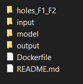
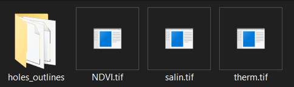

# *BPT DOCKER DEPLOYMENT DETAILED INSTRUCTIONS*

# SETUP

## Required software and files:
Install Docker software.

To run the container on local machine please clone this repository.

If running the code on BPT Server. Follow server connection guide link below. Ignore steps 11 and 12 in this guide. (https://docs.google.com/document/d/1EWIkey5PvKUDpPGHBILDSsQdDnDfjptXSPbtbbrqyt0/edit?usp=sharing) 


In the server, the docker container can be found under *'/samba/brainpooluser/orthomosaics/DockerContainer-Cypress/Server-v.0.0/'*. Some sample files are available under *'/samba/brainpooluser/orthomosaics/16062021F1'*

# Setting environment:
The docker container requires the 'input', 'model' and 'output' folders and the 'Dockerfile'. The 'holes_F1_F2' folder will contain the required files which would help while running the model on different fields.




The contents of input folder should be in the following form:



The contents of this folder **need to be updated for each date** as following:

## holes_outlines:
Copy the contents of *'Server-v.0.0\task-5-deployment\holes_F1_F2\holes_outlines_F*'* (depending on the field number) to 
*'Server-v.0.0\task-5-deployment\input\holes_outlines'*

e.g: if images belong to field 1, copy the contents of *'Server-v.0.0\task-5-deployment\holes_F1_F2\holes_outlines_F1'* to *'Server-v.0.0\task-5-deployment\input\holes_outlines'*

## NDVI, salin, therm:
Download and copy the ndvi, salinity, therm tif files for the date we need to process to *'Server-v.0.0\task-5-deployment\input*. If the docker container is running on local machine, download the sample file from the drive link (https://drive.google.com/drive/folders/1qXrS1So56ZrITZGZpcoliHrodBBSOgR9?usp=sharing). 

If running on BPT server, follow server connection guide and find sample files under *'/samba/brainpooluser/orthomosaics/16062021F1'*.

Please note that it is essential to rename the files exactly as 'NDVI.tif', 'salin.tif' and 'therm.tif', as shown in the image above.


# output:
Is automatically generated once the models are run. Will contain results generated from each of the models. Will look something like this:
```
├── smi
│   └── smi.tif     (SMI Map)
└── thresholding
    ├── Unhealthy_ndvi.gpkg
    ├── Unhealthy_ndvi.tif
    ├── Waterlogged.gpkg
    ├── Waterlogged.tif
    ├── Waterstress.gpkg
    └── Waterstress.tif
└── postproc
    ├── coloredNDVI.tif
    ├── coloredSMI.tif
    ├── coloredSalin.tif
    └── coloredTherm.tif  
```

# RUNNING
Follow instructions in the task-5-deployment/README.md file.
In the CMD terminal:
1.  cd task-5-deployment
2.	docker build . -t cypress_model:latest
3.	
```bash
docker run --rm -it \
-v {{absolute/path/to/input/dir}}:/app/input \
-v {{absolute/path/to/output/dir}}:/app/output \
cypress_model python ./main.py --analysis smi thresholding
```
eg (on server):
```bash
docker run --rm -it -v /samba/brainpooluser/orthomosaics/DockerContainer-Cypress/Server-v.0.0/task-5-deployment/input:/app/input -v /samba/brainpooluser/orthomosaics/DockerContainer-Cypress/Server-v.0.0/task-5-deployment/output/output:/app/output cypress_model python ./main.py --analysis smi thresholding
```
